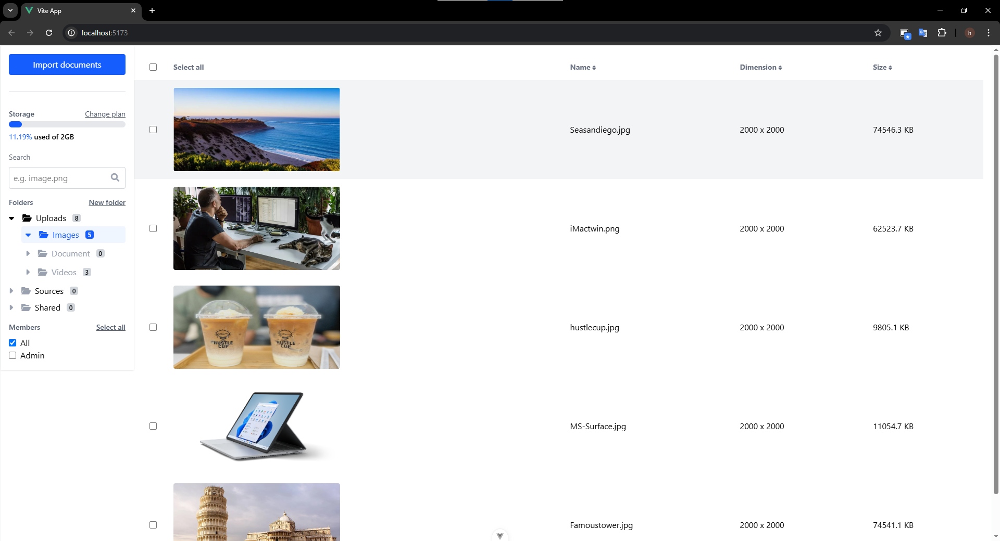

## Project Preview



## Setup Instructions

1. Clone the repository:

```bash
git clone <repository-url>
cd frontend
```

2. Install dependencies:

```bash
npm install
```

3. Run the development server:

```bash
npm run dev
```

The application will be available at `http://localhost:5173`
